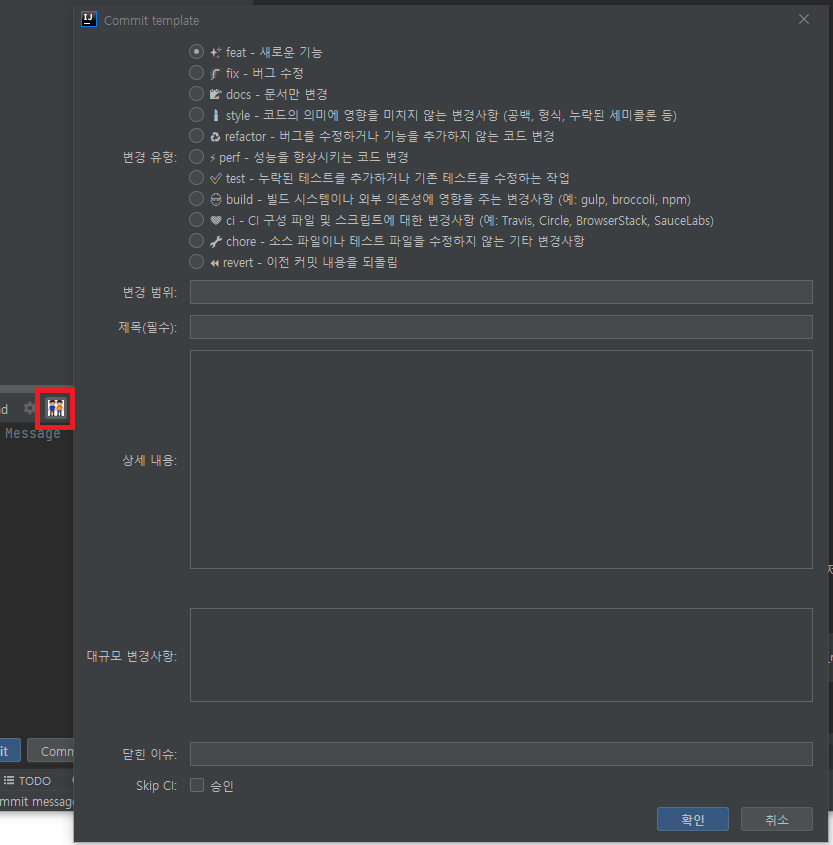
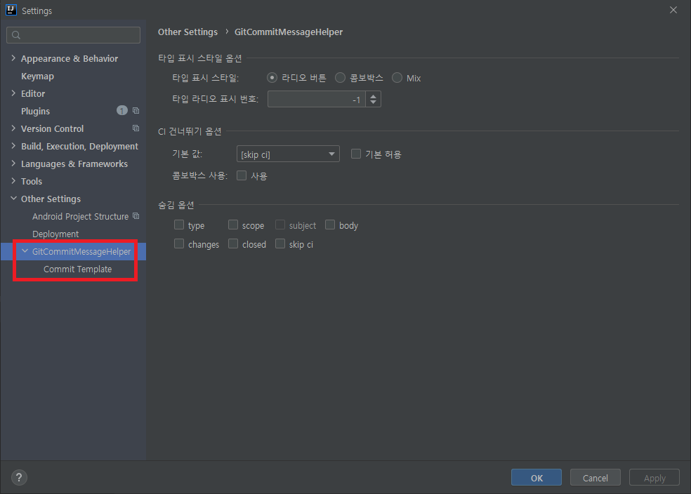
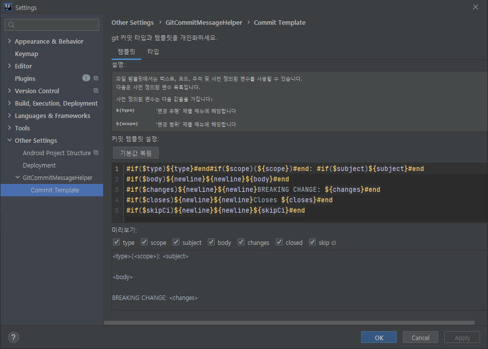
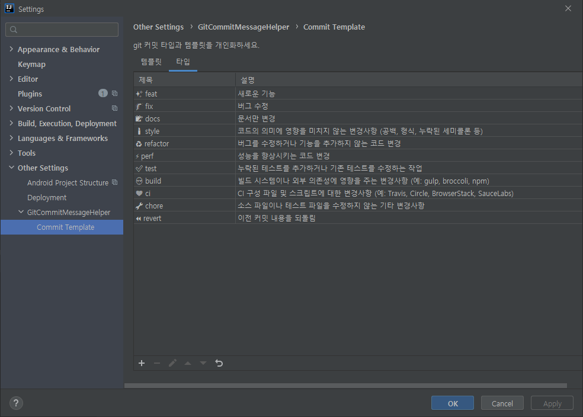

# git-commit-message-helper-ko-emoji-ver
This plugin is an upgraded version of the source idea plugin [git-commit-message-helper](https://plugins.jetbrains.com/plugin/13477-git-commit-message-helper) , adding a series of personalized configurations and Emojis and Korean translations for each type have been added.

이 플러그인은 idea 플러그인인 [git-commit-message-helper](https://plugins.jetbrains.com/plugin/13477-git-commit-message-helper)의 업그레이드 버전입니다. 개인화된 설정을 추가하고 type별 이모지 및 한국어 번역을 추가하였습니다. 

## Installation / 설치 방법
Install directly from the IDE plugin manager (File > Settings > Plugins > Marketplace > Git Commit Message Helper Korean) 

## Usage / 사용법
### Keyboard shortcut / 단축키
    windows : ctrl + alt + g
    mac - cmd + alt + g.

When you commit, you can check the template pop-up by entering a shortcut key or clicking the icon. 
commit 시 단축키를 입력하거나, 아이콘을 클릭하면 템플릿 팝업을 확인할 수 있습니다.

If you need to personalize your settings, you can change them. 
개인화 설정이 필요한 경우, 설정을 변경할 수 있습니다.

## License
Licensed under the  [Apache License](http://www.apache.org/licenses/LICENSE-2.0), Version 2.0 (the "License"); you may not use this file except in compliance with the License.

Unless required by applicable law or agreed to in writing, software distributed under the License is distributed on an "AS IS" BASIS, WITHOUT WARRANTIES OR CONDITIONS OF ANY KIND, either express or implied. See the License for the specific language governing permissions and limitations under the License.

## Thank 
[https://github.com/AutismSuperman/git-commit-message-helper](https://github.com/AutismSuperman/git-commit-message-helper) 